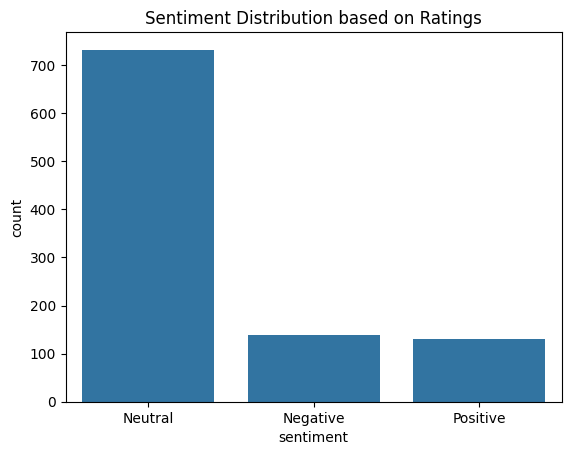
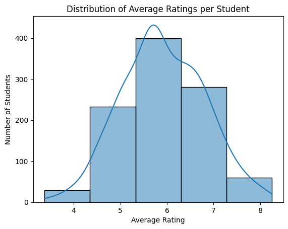

# 🎓 College Event Feedback Analysis

An end-to-end Data Analytics project built using Python and Jupyter Notebook to analyze student feedback from college events and generate actionable insights.

---

## 📌 Project Objective

The main objective of this project is to analyze feedback collected from students after college events. This analysis helps in understanding satisfaction levels, identifying key improvement areas, and making data-driven decisions for future events.

---

## 📊 Dataset Description

The dataset consists of feedback collected from students including:

- Event Rating
- Satisfaction Level
- Feedback Comments
- Event Type
- Participation Details

The data was cleaned and prepared before performing analysis.

---

## 🔍 Key Analysis Performed

### ✔️ Data Cleaning & Preprocessing
- Removed missing and inconsistent values  
- Handled duplicate records  
- Standardized data formats  

### ✔️ Exploratory Data Analysis (EDA)
- Distribution of ratings  
- Event-wise performance comparison  
- Student satisfaction trends  

### ✔️ Data Visualization
- Bar Charts  
- Pie Charts  
- Heatmaps  
- Trend Analysis Graphs  

### ✔️ Insight Generation
- Identified best and worst performing events  
- Found factors affecting satisfaction  
- Highlighted improvement areas  

---

## 📈 Key Insights

- Certain events received consistently high ratings indicating strong engagement  
- Some events showed lower satisfaction due to organization issues  
- Feedback patterns helped identify areas for improvement  
- Data-driven insights can improve future event planning  

---

## 🛠️ Tools & Technologies Used

- **Python**
- **Jupyter Notebook**
- **Pandas**
- **NumPy**
- **Matplotlib**
- **Seaborn**

---

## 📷 Project Preview

---

## 💡 Future Improvements

- Add Sentiment Analysis on feedback comments  
- Build an interactive dashboard (Power BI / Tableau)  
- Automate feedback analysis pipeline  

---

## 🎯 Conclusion

This project demonstrates how data analytics can be used to extract meaningful insights from student feedback. It helps organizations improve event quality and enhance overall student experience using data-driven decisions.

---

## 👤 Author

**Yash Sharma**

🔗 [LinkedIn](https://www.linkedin.com/in/yash-sharma-5527ab398)
🔗 [GitHub](https://github.com/hsaysh)

---

## ⭐ Support

If you found this project useful, please give it a ⭐ on GitHub!
